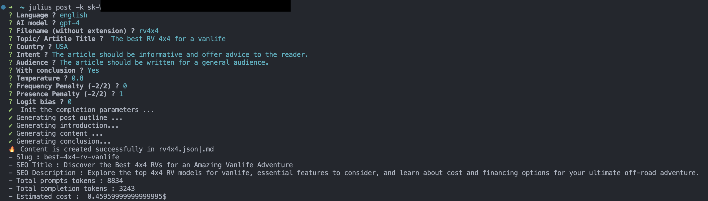

This Node.js CLI and API gives you the ability to generate content with the OpenAI API (GPT-4 or GPT-3.5-turbo). It can generate text in all languages supported by Open AI.

# How it Works

This component can be used in different ways: 
- with the CLI ( interactive mode, automatic mode or with the help of a template).
- In your own application with the API. 

### Interactive / Automatic Mode

In interactive mode, the CLI will ask you for some parameters (topic/title, language, intent, audience, etc.). 

In automatic mode, you need to supply all the necessary parameters to the command line. This mode of operation allows you to create a multitude of contents in series (for example in a shell script).

Both modes will use different predefined prompts to generate the content:

- Generate the outline of the post (with the SEO description, SEO title, the slug)
- Generate the introduction
- Generate the content of the different sections of the outline
- Generate the conclusion

The final result is in Markdown and HTML.

### Template

A template contains a document structure within a series of prompts. Each prompt will be executed in a specific order and will be replaced by the answer provided by the AI.
It is possible to use different formats: Markdown, HTML, JSON, etc.

The main advantage of the template usage is the customisation of the output. You can use your own prompts. Templates are also interesting if you want to produce different contents based on the same structure (product pages, landing pages, etc.).

### Completion Parameters

One of the problems of AI content generation is the repetition of the main keywords.
This script also uses `temperature`, `logit_bias`, `frequency_penalty`, and `presence_penalty` parameters to try to minimize this.
See the [OpenAI API documentation](https://platform.openai.com/docs/api-reference/completions) for more details.

### Publish on Wordpress

When generating, the CLI gives you the ability to publish the content to your WordPress blog.
Other CMS will be supported in the future. We need to support some headless CMS.

### Warning

**This is an experimental project. You are welcome to suggest improvements, like other prompts and other values for the parameters.**
**The cost of the API calls is not included in the price of the CLI. You need to have an OpenAI API key to use this CLI.**
**In all cases, you have to review the final output. AI can provide incorrect information.**

# Examples

## Generated with version 0.0.23

Markdown result: [Understanding Large Language Models: Functions, Applications and Challenges](./examples/llm.md)

JSON file: [llm.json](./examples/llm.json)

## Generated with version 0.0.11

Markdown result: [How to Generate Great Content with GPT-4](./examples/generate-content-gpt4.md)

JSON file: [generate-content-gpt4.json](./examples/generate-content-gpt4.json)

## Generated with version 0.0.9



Markdown result: [Top 4x4 RVs for an Unforgettable Vanlife Experience](./examples/rv4x4.md)

JSON file: [rv4x4.json](./examples/rv4x4.json)


# Installation

The CLI and API are available as an npm package.

```bash
# for the API
npm install julius-gpt -S
# for the CLI
npm install -g julius-gpt
```

# CLI

The CLI has 2 groups of commands:

- post: generate a post
- wp: wordpress related commands : list, add, remove, update wp sites & publish posts

```bash
~ julius -h   
Usage: julius [options] [command]

Generate and publish your content from the command line 🤯

Options:
  -V, --version   output the version number
  -h, --help      display help for a command

Commands:
  post [options]  Generate a post
  wp              Wordpress related commands. The wp list is stored in the local store : ~/.julius/wordpress.json
  help [command]  display help for command


```

## Generate a Post

**You need to have an OpenAI API key to use this CLI**.
You can specify your OpenAI API key with the `-k` option or with the environment variable `OPENAI_API_KEY`.

```bash
 ~ julius post -h
Usage: julius post [options]

Generate a post

Options:
  Options:
  -t, --templateFile <file>                   Set the template file (optional)
  -i, --interactive                           Use interactive mode (CLI questions)
  -l, --language <language>                   Set the language (optional), english by default
  -m, --model <model>                         Set the LLM : "gpt-4" | "gpt-4-32k" | "gpt-3.5-turbo" | "gpt-3.5-turbo-16k" (optional), GPT-4 by default
  -f, --filename <filename>                   Set the post file name (optional)
  -tp, --topic <topic>                        Set the post topic (optional)
  -c, --country <country>                     Set the country (optional)
  -g, --generate                              Generate the audience and intent (optional)
  -co, --conclusion                           With conclusion (optional)
  -to, --tone <tone>                          Set the tone : "informative" | "captivating" (optional)
  -tp, --temperature <temperature>            Set the temperature (optional)
  -fp, --frequencypenalty <frequencyPenalty>  Set the frequency penalty (optional)
  -pp, --presencepenalty <presencePenalty>    Set the presence penalty (optional)
  -lb, --logitbias <logitBias>                Set the logit bias (optional)
  -d, --debug                                 Output extra debugging
  -da, --debugapi                             Debug the api calls
  -k, --apiKey <key>                          Set the OpenAI api key (optional, you can also set the OPENAI_API_KEY environment variable)
  -h, --help                                  display help for command
```

### Automatic Mode 

```bash
 ~ julius post -to "This is the topic of my content"
```
Use the other parameters to personalise content even further.


### Interactive Mode

```bash
 ~ julius post -i
```
It is not necessary to use the other parameters.

### Generate Content Based on a Template

The template file can be in the markdown or HTML format. The template extension will be used to determine the final output.

```bash
 ~ julius post -t <file>.[md|html]
```

The CLI will execute all prompts mentioned in the template file. Each prompt shorts code will be replaced by the output provided by the AI.

**Template structure**

Here is a simple example for the template file:

```
{0:Your are an prompt tester. You have to write your answers in a makrdown block code.}
{1:your answer has to be "Content of prompt 1."}

# Heading 1
{2:your answer has to be "Content of prompt 2."}
````

Prompt 0 is the system prompt.
Prompt with number 1 and 2 will be replaced by the output provided by the AI.

This is an experimental feature and the template syntax will be modified in a upcoming release.

## Wordpress related commands

### list
This command displays the list of all registered Wordpress sites in the local file ~/.julius/wordpress.json. 

**The domain name or the id of the site can be used for the following commands.**

```bash
~ julius wp ls
```

### add

This command adds a new Wordpress site to the local file ~/.julius/wordpress.json.

```bash
~ julius wp add www.domain.com:username:password
```

### info

This command displays the list of all registered Wordpress sites in the local file ~/.julius/wordpress.json.

```bash
~ julius wp info www.domain.com|id
```

### rm

This command removes a Wordpress site from the local file ~/.julius/wordpress.json.

```bash
~ julius wp rm www.domain.com|id
```

### export

This command exports the list of all registered Wordpress sites in the local file ~/.julius/wordpress.json.

```bash
~ julius wp export wordpress_sites.json
```

### import

This command imports the list of all registered Wordpress sites in the local file ~/.julius/wordpress.json.

```bash
~ julius wp import wordpress_sites.json
```

### categories

This command displays the list of all categories of a Wordpress site.

```bash
~ julius wp categories www.domain.com|id
```

### post

This command create a new post on a Wordpress site.
the json file must have the following structure:

```json
{
    "title": "The title of the post",
    "slug": "the-slug-of-the-post",
    "content": "The content of the post",
    "seoTitle": "The SEO title of the post",
    "seoDescription": "The SEO description of the post",
}
```

This JSON file can be generated with the command `julius post` or with the API.

By default, the Wordpress REST API doesn't allow you to update the SEO title and description.
This information is managed by different plugins, such as Yoast SEO. You can code a plugin for this.

An plugin example for Yoast can be found in this directory: [julius-wp-plugin](./examples/julius-wp-plugin)
You can create a zip and install it from the Wordpress dashboard.

You can code something similar for other SEO plugins.

```bash
~ julius wp post www.domain.com|id categoryId post.json
```

- The first argument is the domain name or the id of the site.
- The second argument is the id of the category on this wordpress. you can get the list of categories with the command `julius wp categories www.domain.com|id`
- The third argument is a boolean to indicate if the wp used Yoast SEO plugin. If true, the SEO title and description will be published.
- The fourth argument is the path to the json file containing the post.

### update

This command update a post on a Wordpress site (title, content, SEO title & SEO description).
the json file must have the following structure:

```json
{
    "title": "The title of the post",
    "slug": "the-slug-of-the-post",
    "content": "The content of the post",
    "seoTitle": "The SEO title of the post",
    "seoDescription": "The SEO description of the post",
}
```

This JSON file can be generated with the command `julius post` or with the API.

```bash
~ julius wp update www.domain.com|id slug post.json [-d, --update-date] 
```

- The first argument is the domain name or the id of the site.
- The second argument is the slug of the post to update.
- The third argument is the json file.
- The fourth argument (optional) is to update the publication date or not.

# API

## Automatic Mode

```js
import { OpenAIPostGenerator, Post, PostPrompt } from 'julius-gpt'

const prompt : PostPrompt = {
  topic: 'How to generate a great content with GPT-4 ?',
  language: 'english', // could be any language supported by GPT-4
  withConclusion: true,
  model: 'gpt-4' | 'gpt-3.5-turbo'
  tone: 'informative' | 'captivating' // optional
  apiKey: ' ...', // optional if you use the env var OPENAI_API_KEY
  country: '...', // optional
  intent: '...', // optional
  audience: '...', // optional
  temperature: 0.8, // optional
  frequencyPenalty: 0, // optional
  presencePenalty: 1, // optional
  logitBias: 0, // optional
  debug: true, // optional
  debugapi: true // optional
}

const postGenerator = new OpenAIPostGenerator(prompt)
const post : Post = await postGenerator.generate()
console.log(post)

```

### With a Template

```js
import { OpenAIPostGenerator, Post, PostPrompt } from 'julius-gpt'
const postPrompt : PostPrompt = {
  language: 'english',
  model: 'gpt-4',
  topic: 'Test prompt answer', 
  templateFile: './my-template.md',
  temperature: 0.7, // optional
  frequencyPenalty: 0.5, // optional
  presencePenalty: 0.5, // optional
  logitBias: 0, // optional
  debug: true, // optional
  debugapi: true // optional
  }
const postGenerator = new OpenAIPostGenerator(postPrompt)
const post = await postGenerator.generate()
```

# Some Tools that can Help to Check Quality

- [Quillbot](https://try.quillbot.com/74enc3186nhg):  AI-powered paraphrasing tool will enhance your writing, grammar checker and plagiarism checker.
- [Originality](https://originality.ai?lmref=fJgVFg): AI Content Detector and Plagiarism Checker.

# TODO

- Review prompts for GPT 3.5.
- Customize the prompts for the auto mode.
- Generate images.


# Credit 

- [OpenAI API](https://openai.com/)
- [Travis Fisher](https://transitivebullsh.it/) for his excellent [NodeJS client for OpenAI](https://github.com/transitive-bullshit/chatgpt-api)
